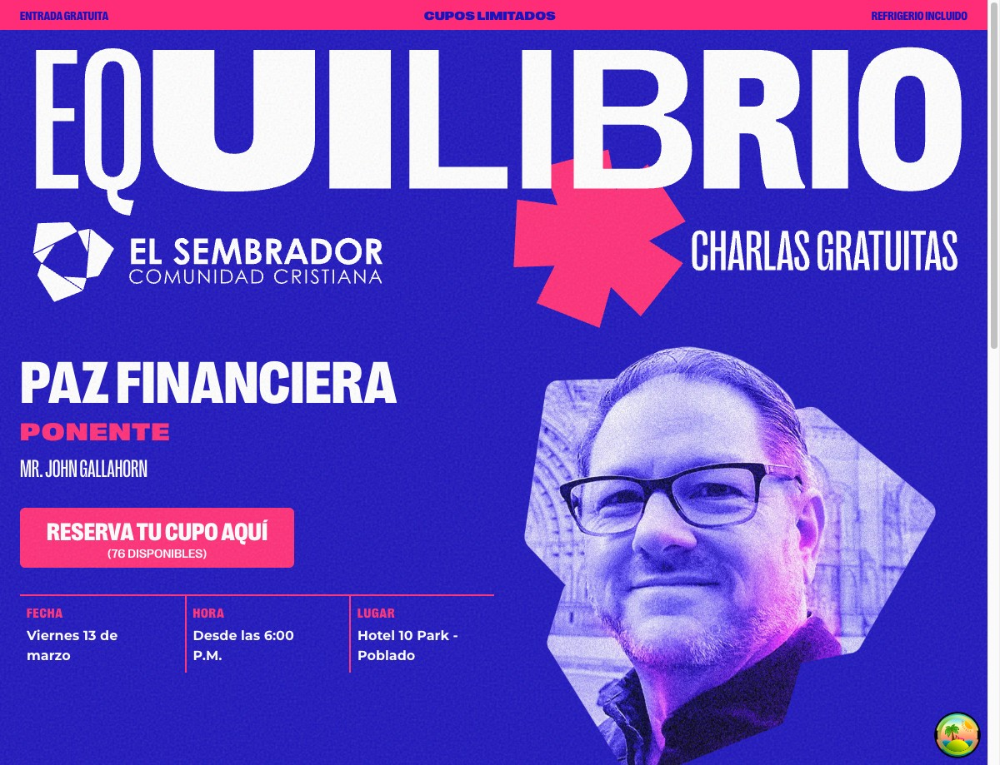
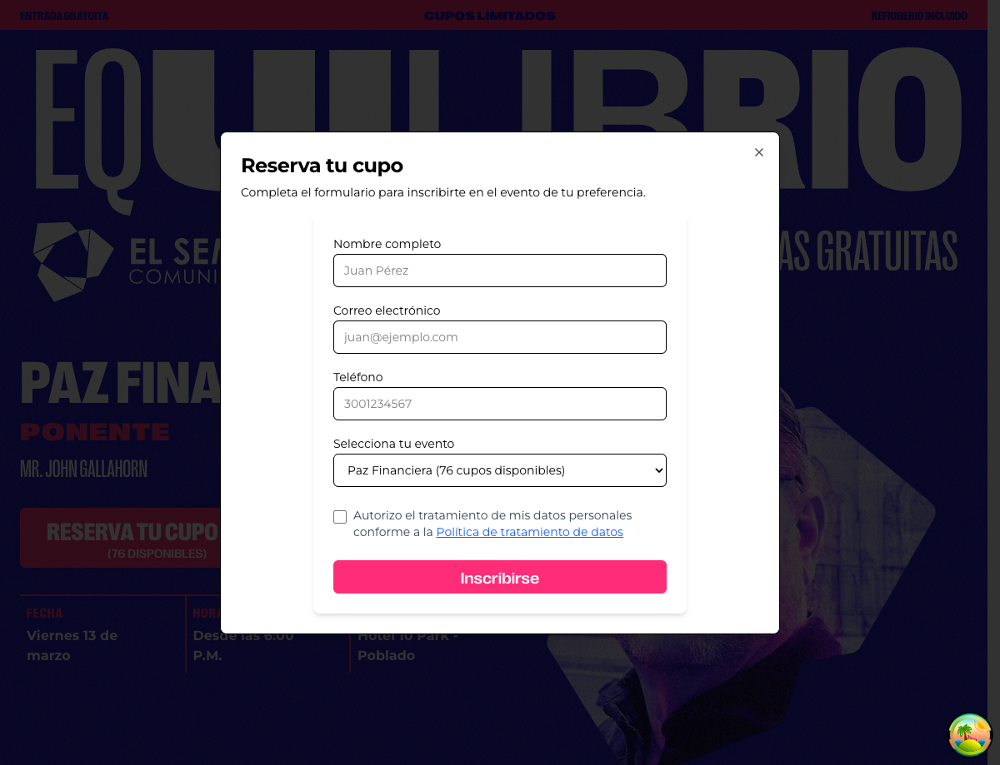
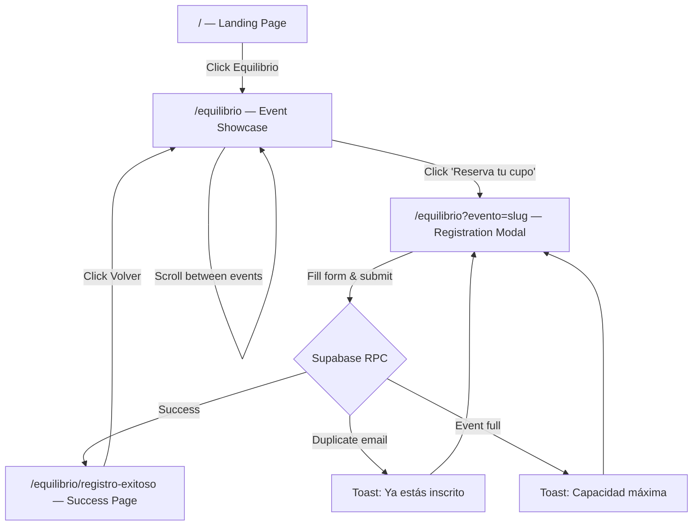
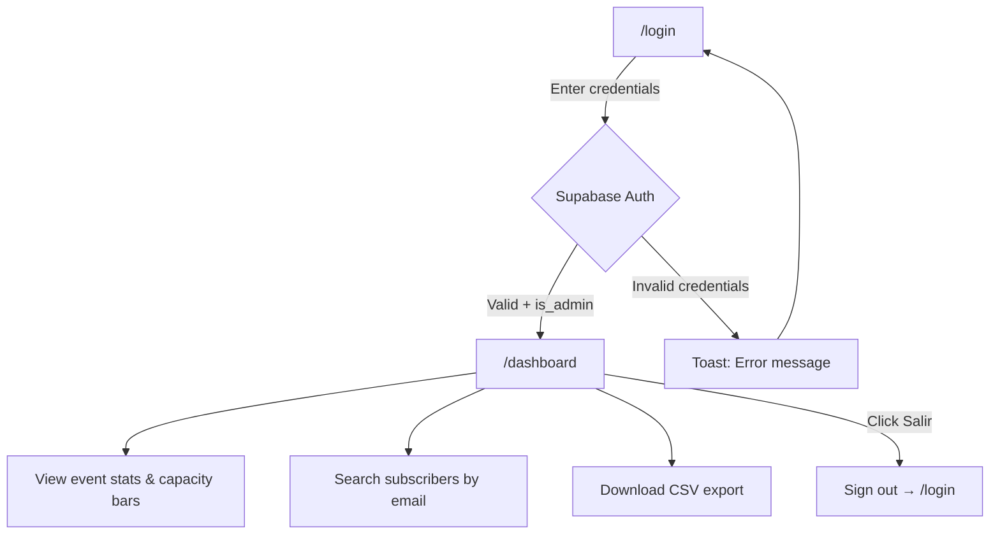
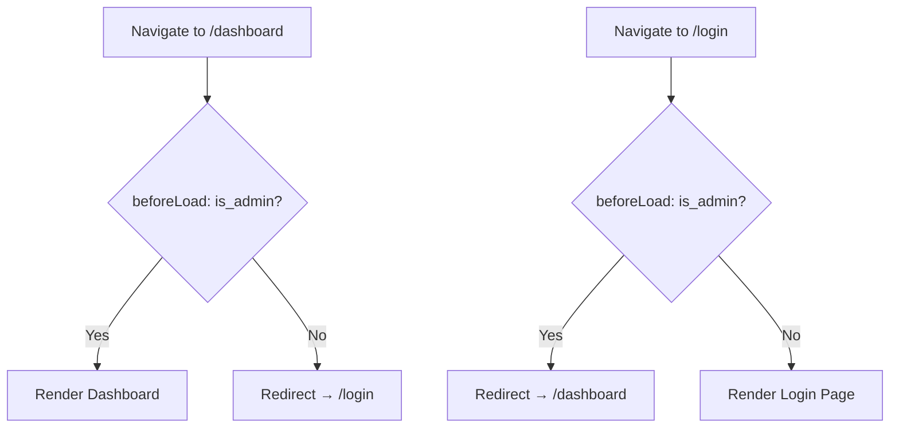

# El Sembrador Colombia — Web

Event management web application for El Sembrador Colombia. A React SPA for showcasing events, handling attendee registrations, and providing an admin dashboard.

## Tech Stack

- **Framework:** React 19 + TypeScript 5.7
- **Build tool:** Vite 7
- **Routing:** TanStack Router (file-based, auto code-splitting)
- **Data fetching:** TanStack Query
- **Forms:** TanStack Form + Zod validation
- **UI primitives:** Radix UI (headless dialog, slot)
- **Styling:** Tailwind CSS 4, CVA (class-variance-authority), tailwind-merge
- **Icons:** lucide-react
- **Toasts:** sonner
- **SEO:** react-helmet-async
- **Backend:** Supabase (auth, database, RPC)
- **Analytics:** Google Analytics (GA4), Meta Pixel (custom events)
- **Performance:** web-vitals
- **Linting/Formatting:** Biome
- **Package manager:** pnpm

## Screenshots

| Landing Page | Event Showcase | Registration Modal |
|:---:|:---:|:---:|
|  |  |  |

## Getting Started

### Prerequisites

- Node.js 18+
- pnpm

### Environment Variables

Create a `.env` file in the project root:

```env
VITE_SUPABASE_URL=<your-supabase-project-url>
VITE_SUPABASE_ANON_KEY=<your-supabase-anon-key>
VITE_GA_MEASUREMENT_ID=<your-ga4-measurement-id>
VITE_META_PIXEL_ID=<your-meta-pixel-id>
```

### Install & Run

```bash
pnpm install
pnpm dev
```

The dev server starts on `http://localhost:3000`.

## Scripts

| Command | Description |
|---------|-------------|
| `pnpm dev` | Start dev server |
| `pnpm build` | Production build (includes type-check) |
| `pnpm preview` | Preview production build |
| `pnpm test` | Run tests (Vitest) |
| `pnpm lint` | Lint with Biome |
| `pnpm format` | Format with Biome |
| `pnpm check` | Full Biome check (lint + format) |

## Project Structure

```
src/
├── assets/
│   ├── fonts/              # Custom Right Grotesk font family (4 variants)
│   └── images/             # Speaker photos, SVG logos
├── components/
│   ├── dashboard/          # Admin dashboard (EventCard, SubscribersTable, SubscriberSearch)
│   ├── equilibrio/         # Event showcase (EventBadge, EventShowcaseSection, SubscriptionModal)
│   ├── forms/              # Form components (SubscriptionForm)
│   ├── ui/                 # Base UI primitives (alert, button, dialog, input, label, select)
│   ├── Header.tsx          # App header with sidebar navigation
│   └── LogoEquilibrio.tsx  # Dynamic SVG logo with theme color support
├── lib/
│   ├── constants/          # Static data (event details map)
│   ├── hooks/              # Custom hooks (useAuth, useCreateSubscription, useDashboardData, useEvents, useEventsWithDetails, useScrollSpy)
│   ├── services/           # Supabase service layer (auth, dashboard, events)
│   ├── types/              # TypeScript type definitions
│   ├── validations/        # Zod schemas (subscription with disposable email blocking)
│   ├── database.types.ts   # Auto-generated Supabase DB types
│   ├── supabase.ts         # Supabase client instance
│   └── utils.ts            # Utility functions (cn)
├── routes/
│   ├── equilibrio/
│   │   ├── index.tsx              # Event showcase with scroll-spy (/equilibrio)
│   │   └── registro-exitoso.tsx   # Registration success (/equilibrio/registro-exitoso)
│   ├── __root.tsx           # Root layout (HelmetProvider, Toaster, TanStack devtools)
│   ├── dashboard.tsx        # Admin dashboard (/dashboard)
│   ├── equilibrio.tsx       # Equilibrio layout route
│   ├── index.tsx            # Landing page (/)
│   ├── login.tsx            # Admin login (/login)
│   └── politica-de-datos.tsx  # Data privacy policy
├── main.tsx                 # Entry point (router, QueryClient, analytics, auth context)
├── reportWebVitals.ts       # Web Vitals performance tracking
├── styles.css               # Global styles (Tailwind imports)
└── routeTree.gen.ts         # Auto-generated — DO NOT edit
```

## Pages

- **`/`** — Landing page
- **`/equilibrio`** — Event showcase with speaker info, scroll-spy sections, and registration modals
- **`/equilibrio/registro-exitoso`** — Post-registration success page with Meta Pixel tracking
- **`/login`** — Admin authentication
- **`/dashboard`** — Admin-only dashboard with event stats, subscriber tables, and email search
- **`/politica-de-datos`** — Data privacy policy (Ley 1581 de 2012)

## User Flows

### Attendee Registration



### Admin Dashboard



### Auth Guards



## Key Conventions

- **Path alias:** `@/*` maps to `./src/*`
- **Route files** in `src/routes/` are auto-detected; `routeTree.gen.ts` is generated automatically
- **Biome** handles linting and formatting — tab indentation, double quotes
- **TypeScript** strict mode is enabled
- **Tailwind CSS** utility classes for all styling
- **Component variants** use CVA (class-variance-authority) with `cn()` utility for class merging
- **Analytics** — SPA pageview tracking for both GA4 and Meta Pixel via router `onResolved` events; custom Meta Pixel events for subscription actions
- **SEO** — Per-page titles via react-helmet-async; OpenGraph and Twitter Card meta tags in index.html
